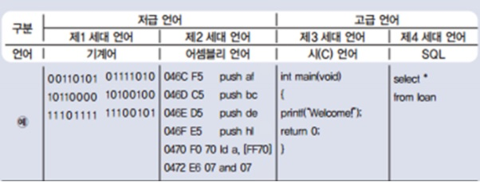

# 개념 정리

## 프로그레밍 언어 
> - 고급 프로그래밍 언어란 사람이 이해하기 쉽게 작성된 프로그래밍 언어 이다.
> - 이해 가능 정도에 따른 분류 중 하나이며. 이는 저급언어와 고급언어로 나뉜다.
> - 고급 프로그래밍 언어와 저급 프로그래밍 언어란 사람이 접근하기 쉬운가 어려운가의 차이를 두고 기준으로 하여 나뉘어져 있다.
> - 사람들에게 친숙한 언어로 이루어 질수록 고급 언어에 속하고 컴퓨터가 이해하기 쉽고 가까운 언어 일수록 저급언어로 분류 된다.

### **H**igh **L**evel Language
> **고급언어**
> - 저급 프로그래밍 언어 보다 가독성이 높고 다루기 간단하다.
> - C언어, 자바 등 대부분의 프로그래밍 언어들은 고급언어에 속한다.
> - 저급언어와는 다르게 특정 컴퓨터와 관계없이 독립적으로 프로그램을 만들 수 있다.
> - 고급언어를 컴퓨터 언어인 기계어로 변환하기 위해 컴파일러와, 인터프리터 등이 있다.
> - 기계어로 변환하는 동안 시간이 소요되며 저급언어보다 프로그램 크기가 더 크다.
> > ex) `C`, `C++`, `C#`, `JAVA`, `JavaScript`, `Python`, `Kotlin` 등

### **L**ow **L**evel Language
> **저급언어**
> - 컴퓨터가 이해하기 쉬운 이진법으로 이루어진 언어이다
> - 컴퓨터가 바로 이행 할 수 있지만 가독성 및 생산성이 낮다.
> - 프로그램 속도가 빠르다.
> - 프로그램 크기 또한 고급언어 보다 작다.
> - 저급언어에는 기계어와 어셈블리어 등이 있다.
> > **기계어**
> > - 기계어란 cpu가 직접 해독하고 실행할 수 있는 비트 단위로 쓰인 컴퓨터 언어를 통틀어 일컫는다.
> > - 기계어는 프로그램을 나타내는 가장 낮은 단계의 개념이다.
>
> > **어셈블리어**
> > - 어셈블리어란 기계어를 사람이 이해하기 쉬운 기호와 1 : 1로 대응시켜 기호화한 프로그램 언어이다.
> > - 기호 언어라고도 부른다.

 

## 웹 통신
### `WWW`(**W**orld **W**ide **W**eb)
> - 전 세계를 하나로 잇는 하나의 통신 시스템으로 거미줄(Web)같이 연결된 하나의 통신시스템을 이야기 한다. 우리는 인터넷이라 퉁쳐서 부르지만 인터넷은 MicroSoft사에서 사용한 웹 브라우저에 불과하다.
> - 웹통신의 시작은 대부분의 기술들이 그러하듯 군사기술에서 시작했고, 그 것을 대중에게 상품으로 사용하여 개량한 것이 지금의 웹통신이다.

### `HTML`(**H**yper **T**ext **M**arkup **L**anguage)
> 웹 사이트를 표현하기 위한 표현 형식으로 이름은 언어(Language)로 불리지만 개발언어로 분류되지 않는다.
> - W3C(`World Wide Web Consortium`)에 의해 관리 되고 발전되어 왔다.
> > 월드 와이드 웹을 위한 표준을 개발하고 장려하는 조직
> - `2.0`부터 발표되어 `5`까지 발전해왔다.
> > 1995년 11월 24일 최초 발표
> > 2008년 1월 HTML5 발표

## 네트워크
### IP / PORT
우리는 IP와 PORT의 조합으로 기본적인 네트워크를 한다. 모든 통신망은 집주소가 있듯 네트워크상에서 할당된 주소가 존재한다. 그것이 IP이다. 그리고 그 주소의 집에 도착했을때 들어갈 수 있는 문을 PORT라고 생각하면 이해가 쉬울것이다.
- IP(Internet Protocol)
  > 인터넷 프로토콜(**I**nternet **P**rotocol)은 송신 호스트와 수신 호스트가 패킷 교환 네트워크(패킷 스위칭 네트워크, Packet Switching Network)에서 정보를 주고받는 데 사용하는 정보 위주의 규약(프로토콜, Protocol)이며, OSI 네트워크 계층에서 호스트의 주소지정과 패킷 분할 및 조립 기능을 담당한다. 줄여서 아이피(IP)라고도 한다.
- Port
  > 호스트 내에서 실행되고 있는 프로세스를 구분짓기 위한 16비트의 논리적 할당.
  > 범위 : 0~65536

### 서버 / 클라이언트
### 서버(Server)
> 서버(`server`)는 클라이언트에게 네트워크를 통해 정보나 서비스를 제공하는 컴퓨터 시스템으로 컴퓨터 프로그램(server program) 또는 장치(device)를 의미한다. 특히, 서버에서 동작하는 소프트웨어를 서버 소프트웨어(server software)라 한다. 주로 리눅스 등의 운영 체제를 설치한 대형 컴퓨터를 쓰지만, 그렇지 않은 경우도 있다.

### 클라이언트(Client)
> 네트워크를 통하여 서버라는 다른 컴퓨터 시스템 상의 원격 서비스에 접속할 수 있는 응용 프로그램이나 서비스를 말한다.

### Protocol ( `http` / `https`... )
프로토콜은 일종의 약속이다. 우리가 네트워크망을 통해 통신을 하려면 각 통신별로 약속된 형태로 데이터를 주고 받아야 한다. 이는 마치 우리가 의사소통을 하려면 말이나 글을 통해 하기로 약속한 것과 같다.

프로토콜은 크게 두가지로 나뉜다. 
1. `TCP`(**T**ransmission **C**ontrol **P**rotocol)
   - 데이터를 주고 받을 양단 간에 먼저 연결을 설정

2. `UDP`(**U**ser **D**atagram **P**rotocol)
   - 연결을 설정하지 않고 수신자가 데이터를 받을 준비를 확인하는 단계를 거치지 않고 단방향으로 정보를 전송한다.

> `Http`(Hyper Text Transfer Protocol)
> -  HTML 문서를 주고받는 데에 쓰인다. 주로 TCP를 사용하고 HTTP/3 부터는 UDP를 사용하며, 80번 포트를 사용한다. 1996년 버전 1.0, 그리고 1999년 1.1이 각각 발표되었다.
> 
> `Https`(HyperText Transfer Protocol over Secure Socket Layer)
> -  HTTP의 보안이 강화된 버전이다. HTTPS는 통신의 인증과 암호화를 위해 넷스케이프 커뮤니케이션즈 코퍼레이션이 개발했으며, 전자 상거래에서 널리 쓰인다.

### WAS ( **W**eb **A**pplication **S**erver )
### 웹사이트 구동원리