# Class01

## 개발환경 구축

### 목차

| No   | List                                                         |
| ---- | ------------------------------------------------------------ |
| 1  | [자바설치](#1-자바-설치)                |
| 2  | [환경변수 설정](#2-환경변수-설정)  |
| 3  | [Eclipce](#3-Eclipce)  |
| 4  | [Hello World 출력](#4-Hello-World출력)  |

### 1 자바 설치

- [Java SE Development Kit 8 - Downloads | Oracle 대한민국](https://www.oracle.com/kr/java/technologies/javase/javase-jdk8-downloads.html)
  - Oracle JDK8 (OS 확인 후 설치)
    - 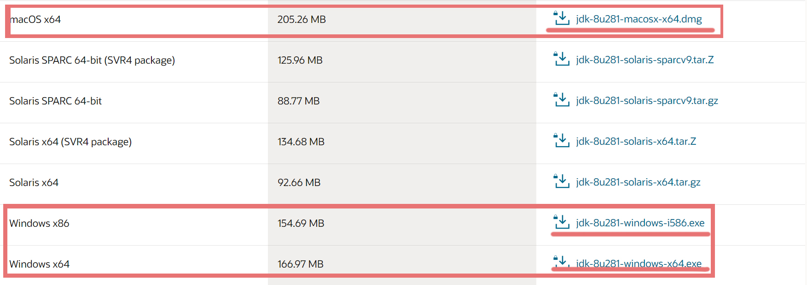


### 2 환경변수 설정

- MacOS
  - 터미널 > `]# vi .bash_profile`
  - `i`  > `export JAVA_HOME=/Library/Java/JavaVirtualMachines/jdk1.8.0_241.jdk/Contents/Home` > `ESC` > `:wq` > `ENTER`
- Windows
  
  - **`내컴퓨터 `** > **`속성 `**> **`고급설정`**
  
    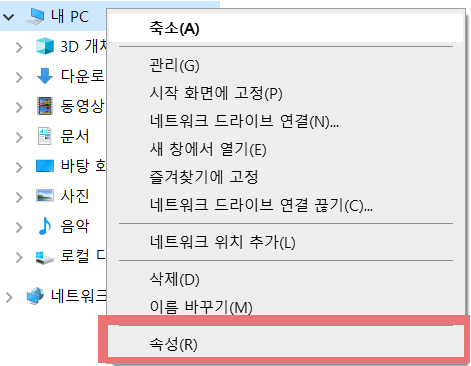
  
  - **`고급 시스템 설정`** > **`환경 변수`**
  
    - 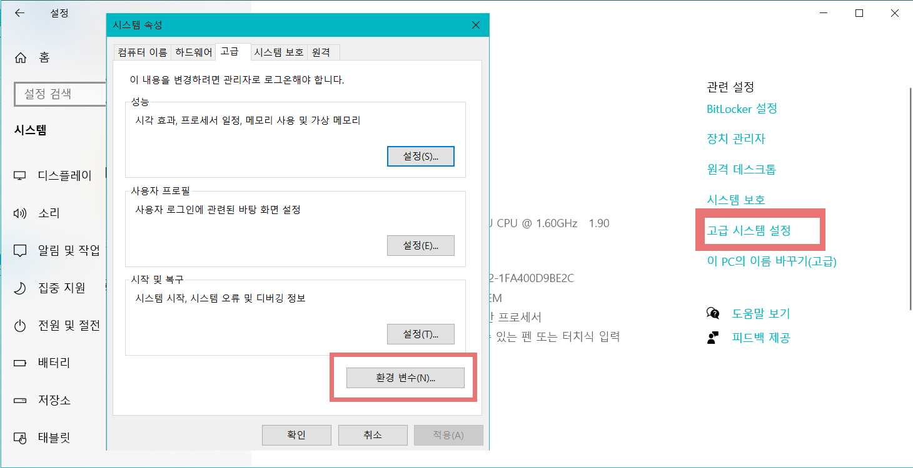
  
  - **`시스템 변수`** > **`새로 만들기`** > **`변수 이름 / 변수 값`**
    - 변수 이름 : **`JAVA_HOME`**
    - 변수 값 : `C:\Program Files\java\jdk[version]`
    - 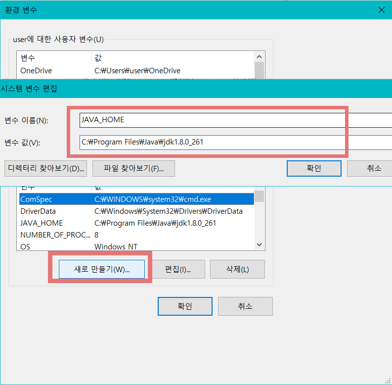
  
  - **`Path` 에 경로 추가**
    - `시스템 변수` > `Path` > `편집`클릭
    - `새로 만들기` > `%JAVA_HOME%\bin` 입력 > 확인
    - 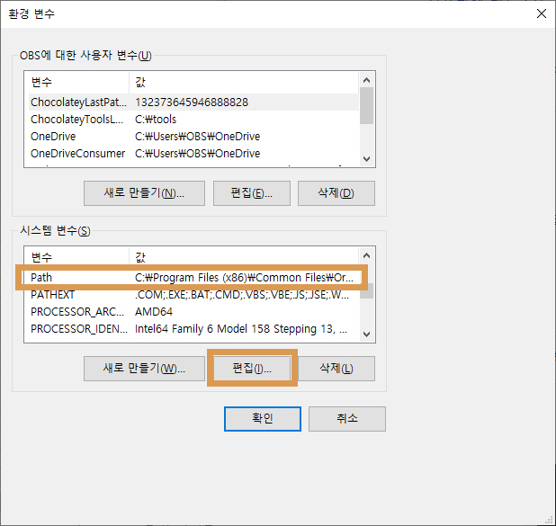
    - 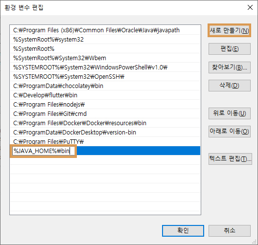


### 3 Eclipce

이클립스는 통합 개발 툴이다. 통합이라고 하는 이유는 많은 기능을 가지고 있는 강력한 툴이기 때문이다. 코딩, 컴파일, 테스트, 배포, 패키징, 프로젝트 관리 등등 많은 기능을 지원한다. 또한 자바뿐만 아니다 다른 많은 언어들도 지원하기 때문에 많은 개발자들이 추천하는 개발 툴이다.

- 다운로드

  - 이클립스는 설치버전과 비 설치 버전이 있다. 우리는 비설치 버전을 다운받아서 사용한다.

  - [다운로드]: https://www.eclipse.org/downloads/packages/

  - 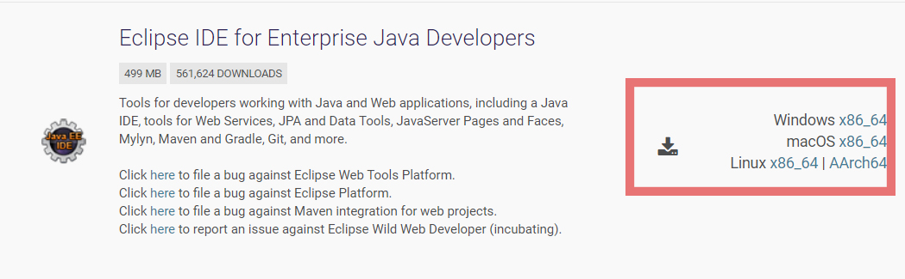
  
  - 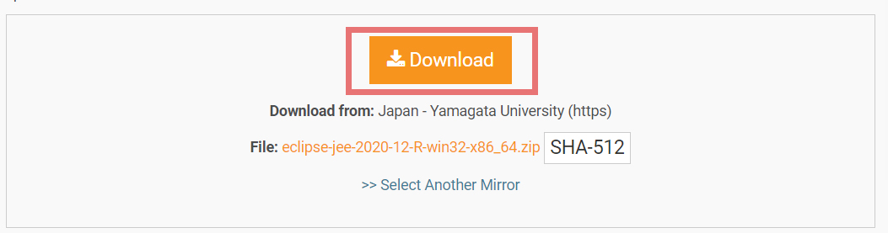
  
  - 자신이 쓰는 OS에 맞게 다운로드한 후 압축을 푼다.
  
    - 
    더블클릭 하여 실행한다.
  
  - 로딩화면이 뜨면 잠시 기다린다.
  
    - 
  
    
  
  - 아래 창이 뜨면 이클립스가 관리할 프로젝트 디렉토리를 설정한다.
  
    - 우리는 앞으로 지금 설정한 프로젝트 경로에서 모든 실습과 코드를 관리할 것이다. 그러므로 관리할 경로를 잘 기억할 수있는 장소로 선택하여 `Launch`를 누르면 이클립스가 실행된다.
    - 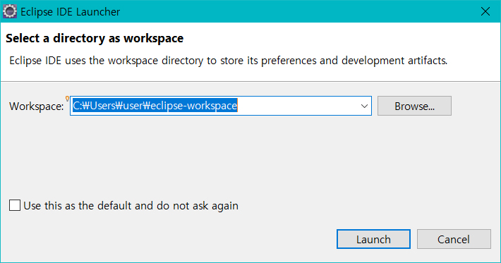
  
  - 첫화면
  
    - 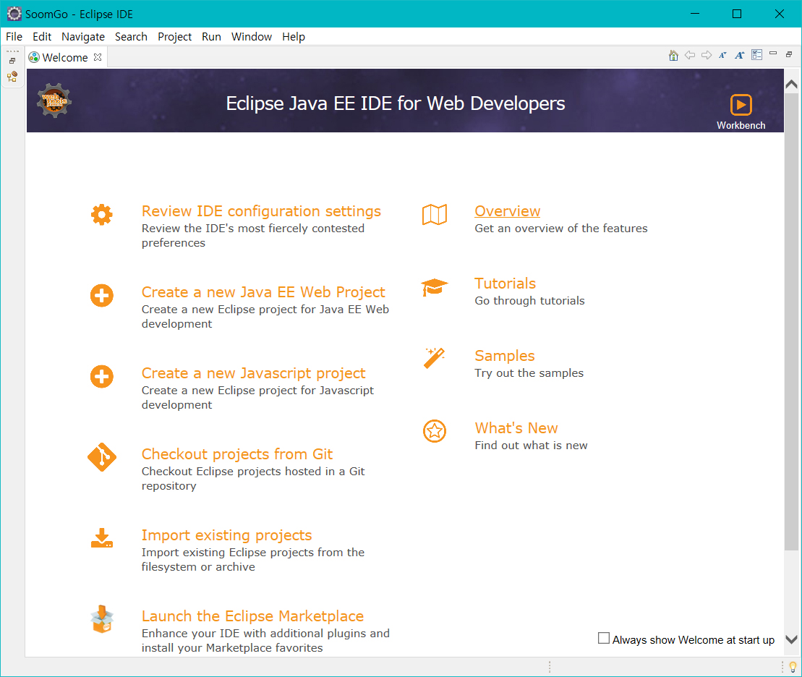
    - 위 이미지와 같이 뜨면 성공이다.
  
- 프로젝트 생성

  - 프로젝트는 우리가 만들 하나의 프로그램 단위라고 보면된다. 우리는 이 프로젝트를 통해 공부하는 과정을 관리하게 될것이다. 
  - 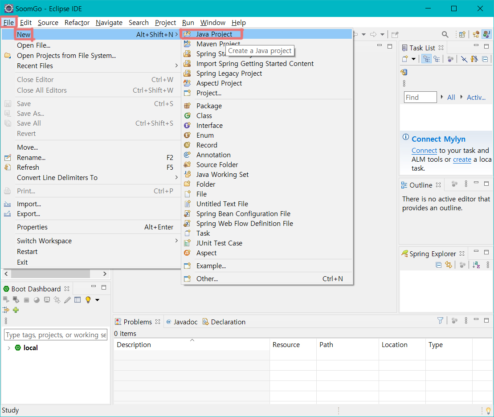
  - 이클립스 메뉴 바 >`File`>`New`>`Java Project` 클릭
  - 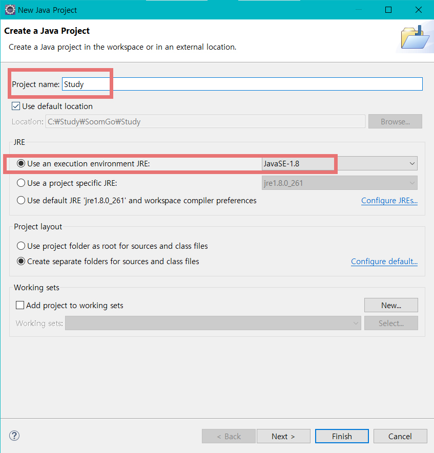
    - `Project name` : 이곳에는 프로젝트 이름을 입력한다. 
    - `JRE` > `Use an excution environment JRE` 체크
    - 우리가 이번 공부에서 사용할 자바 버전은 8버전이니 `JavaSE-1.8`을 선택한다.
    - 하단에 `Finish`버튼을 눌러 프로젝트를 생성한다.
  - 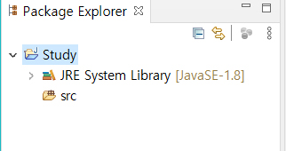
  - `Package Explorer`에 프로젝트가 생성됐다.
  - `JRE System Library` : 프로젝트는 기본적인 자바를 다루기 위한 지초 프로젝트로서 자바가 가지고 있는 기본기능들만 포함한다. 그 기능들은 `JRE System Library`라는 위치에 집합되어 있고, 이를 언제든지 제한없이 사용할 수 있다.
  - `src` : 이곳이 우리가 코딩할 위치이다. 여기에 소스코드를 작성한다.


### 4 Hello World출력

- 패키지 생성

  - 패키지랑 프로젝트 안에서 폴더구조라고 보면된다. 폴더구조와 완전 동일하니 크게 복잡하게 생각할 필요가 없다. 자바 심화 과정에서 다시 배울 것이니 폴더라고 이해하고 넘어가면 된다.

  - 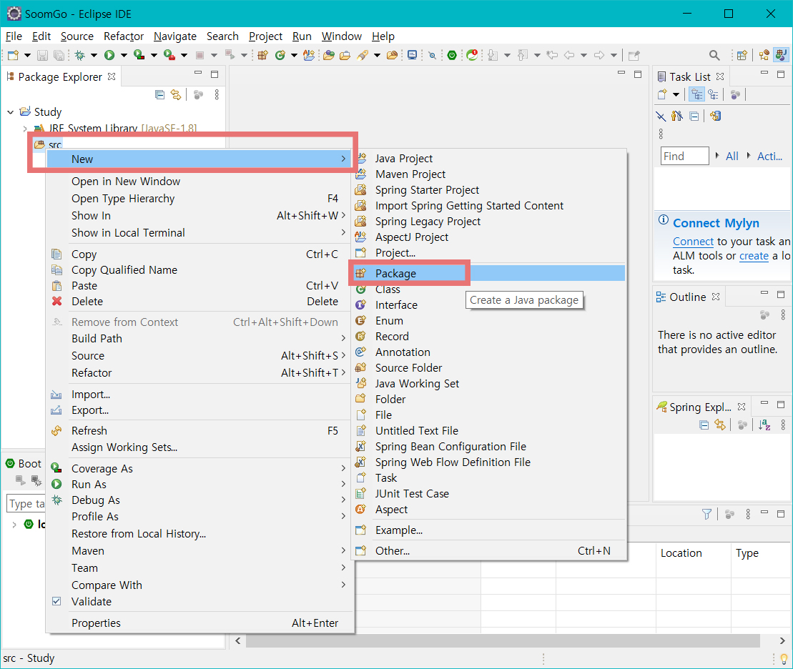

    - `src` >`마우스 우클릭` > `New` > `Package` 클릭

    

  - 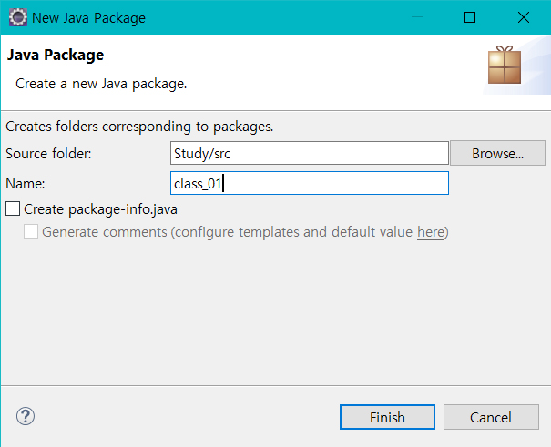

    - `Name` : class_01 입력 > `Finish`클릭

  - 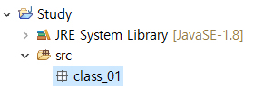

    - 패키지가 생성됐다.

  - 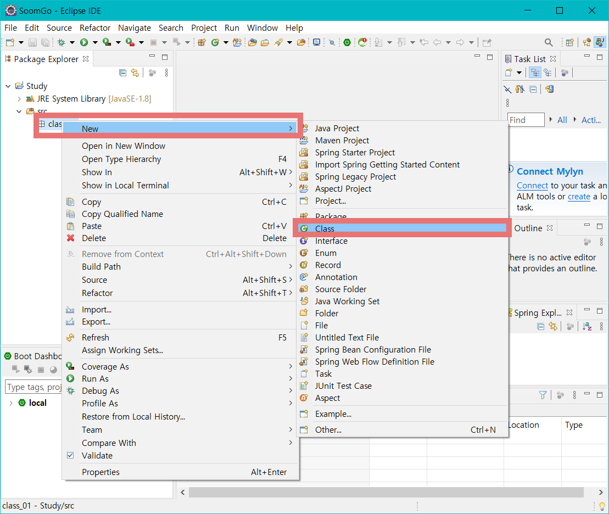

    - `class_01` 우클릭>`New`>`Class` 클릭

  - 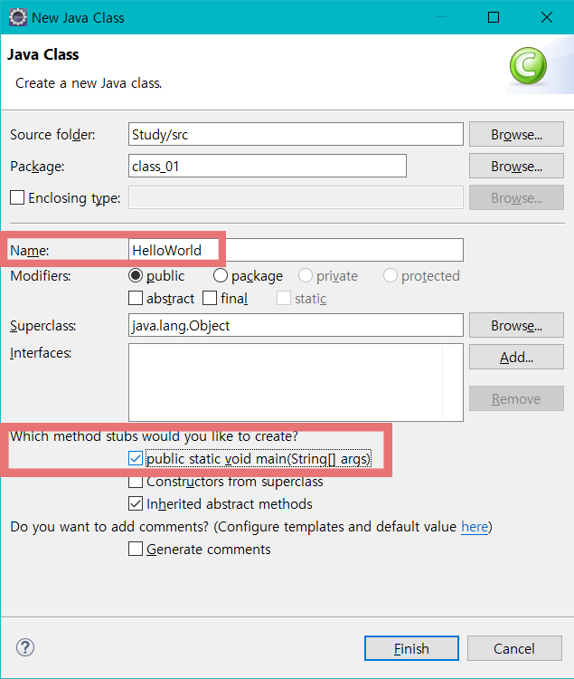

    - `Name` : HelloWorld
    - `Which method stubs would you like to create?` > `public static void main(String[] args)` 체크 > `Finish` 클릭

    

  - 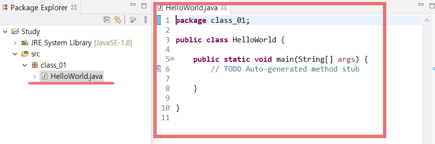

    - 좌측 `Package Explorer`에 방금 생성한 이름의 `HelloWorld.java`가 생성된것이 보인다. 그리고 우측에 그 파일이 자동으로 열려있다.

  

  - ```java
    public static void main(String[] args){
        //TODO Auto-generated method stub
        System. out.println("Hello world");
    }
    ```

    - 모든 코딩은 중괄호(`{ }`) 안에 들어가야 한다. 그러므로 `public static void main(String[] args){}`의 중괄호 안에 `System.out.println("Hello World");` 를 입력하고 저장한다.
      - 세미콜론 `;`을 잊지 말아야 한다. 자바에서 모든 명령어 마지막에는 세미콜론이 있어야 한다. 

  - 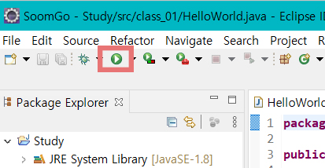

    - 실행 : 이클립스 상단 버튼 모음에 `run`버튼 클릭 or `Ctrl`+`F11` 을 누르면 실행된다.

  - 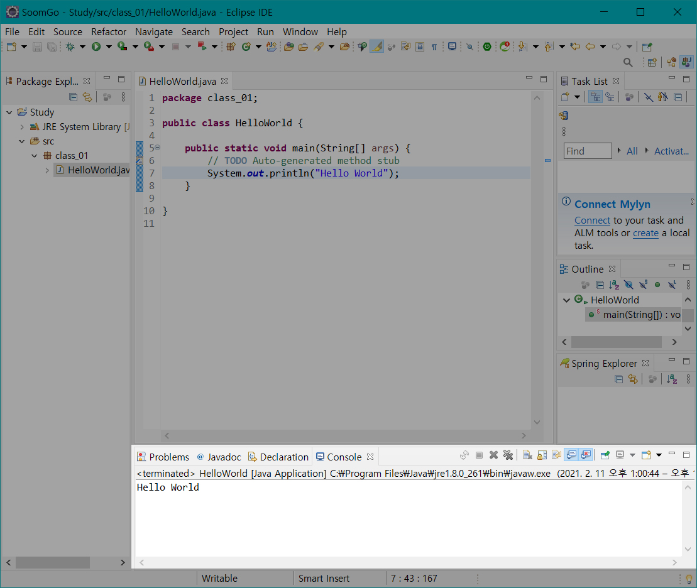

    - 위 이미지와 같이 이클립스 아래쪽 창을 보면 우리가 `System.out.println("Hello World");` 라고 입력한 내용이 출력된다.
