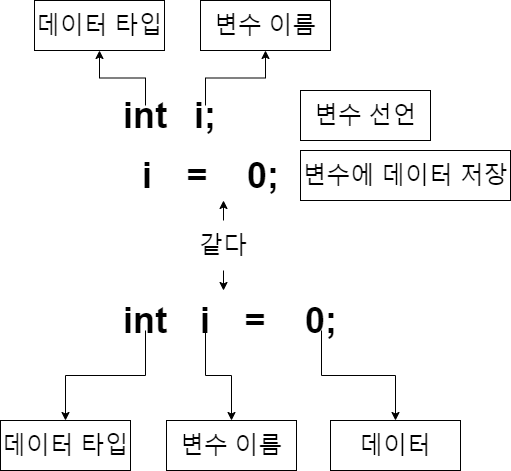

# **Chapter 02. 변수(Variable)**
## 변수 선언


## **데이터 타입**
### 정수형
`byte`
> 1byte(8bit)로 -128 ~ 127 까지 숫자를 저장할 수 있다.

<br>

`short`
> 2byte(16bit)로 -32,768 ~ 32,767 까지 숫자를 저장할 수 있다. 

<br>

`int`
> 4byte(32bit)로 -2,147,483,648 ~ 2,147,483,647 까지 숫자를 저장할 수 있다.

<br>

`long`
> 8byte(64bit)로 -9,223,372,036,854,775,808 ~ 9,223,372,036,854,775,807 까지 숫자를 저장할 수 있다.

<br>

자료형마다 가질 수 있는 숫자의 범위는 있지만 다루는 숫자의 범위가 작다고 `byte`나 `short`를 쓰지 않아도된다. 연산이 되는 경우 내부에서 `int`로 변경되어 계산되기 때문인데 이는 우리가 `byte`나 `short`에 연연하지 않아도 된다는 의미이다.

<br>

### 실수형
`float` 와 `double`
> 이 두 타입을 붙여놓은 이유는 간단하다. `double`는 `float`보다 더 크거나 작은수를 표현할 수 있다. 그뿐이다.

정리하면 우리가 자바에서 숫자를 다룰때 `정수형`인지 `실수형`인지만 잘 구분한다면 어려움이 없을것이다.

<br>

### 문자형
`char`
> 단 1개의 문자만 저장가능한 기본형 데이터 타입이다.

<br>

`String`
> 문자열을 다루는 객체이다. 데이터 타입으로 생각하면 나중에 혼돈이 올수 있으니 그냥 이건 객체라고 알고 넘어가자

<br>

### 논리형
`boolean`
> `true`와 `false` 두가지 값만 가질수 있는 논리형 데이터 타입이다.

<br>

### 산술 연산자
`+` : 더하기 연산자
> - `1+2` 와 같이 두항의 값을 더하는데 사용하며, 문자와 문자를 이어붙일때도 사용한다. 
> - `'A'+'B'` 이때 값은 `"AB"`가 된다.단순히 뒤에 이어붙인다.

<br>

`++` : 증가 연산자
> 값이 1씩 증가한다.

<br>

`-` : 빼기 연산자
> - `1-2` 와 같이 두항의 값을 빼는데 사용하며, 빼기는 문자에는 사용할 수 없다.

<br>

`--` : 감소 연산자
> 값이 1씩 감소한다.

<br>

`*` : 곱하기 연산자
> 두 항의 값을 곱한다.

<br>

`/` : 나누기 연산자
> 두 항의 값을 나눈다.

<br>

`%` : 나머지 연산자
> 두항의 값을 나누고 나머지를 결과값으로 반환한다.

<br>

### 비교연산자
`>`, `<` ,`==`, `<=`, `>=`
> 두 항을 비교하여 `true`나 `false`를 반환한다.
> 
> `>` , `<` 
> > `A > B`
> > - A항이 B항보다 크면 `true`
> > - A항이 B항보다 작거나 같으면 `false`
> 
> > `A < B`
> > - B항이 A항보다 크면 `true`
> > - B항이 A항보다 작거나 같으면 `false`
>
> `==`
> > `A == B`
> > - A항과 B항이 완전히 같을때 `true` 다르면 `false`
>
> `>=`, `<=`
> > `A >= B`
> > - A항이 B항보다 크거나 같으면 `true`
> > - A항이 B항보다 작으면 `false`
> 
> > `A <= B`
> > - A항이 B항보다 작거나 같으면 `true`
> > - A항이 B항보다 크면 `false`

<br>

### 삼항연산자
>`A>B?true:false`
> - A와 B를 비교하여 `true`면 true자리에 있는 값을 반환하고, `false`면 false자리에 있는 값을 반환한다.
> ```JAVA
> String age = 10;
> String grade = age > 13 ? "중딩":"초딩";
> ```
> `age`가 13보다 크면 `grade`는 `중딩`을 저장하고, 아니면 `초딩`을 저장한다.

<br>

### 조건문
`if`문
> ```java
> if(A > B ){
>   ....
> }
> ```
> `if`뒤의 괄호(`()`)안의 결과가 `true`일때 괄호(`()`) 뒤의 중괄호(`{}`)안의 내용이 수행된다.

<br>

`if else`문
> ```java
> if(A > B ){
>  ...
> }else{
>  ...
> }
> ```
> `if`뒤의 괄호(`()`)안의 결과가 `false`일때 `else`뒤의 중괄호(`{}`)안의 내용이 수행된다.

<br>

`switch`
> ```JAVA
> int i = 0;
> switch(i){
>   case 0:
>       System.out.println("영");
>   case 1:
>       System.out.println("일");
>   case 2:
>       System.out.println("이");
>       break;
>   case 3:
>       System.out.println("삼");
>   default:
>       System.out.println("없음");
> }
> ```
> `switch()`의 괄호`()`안에 있는 값이 `case` 뒤에오는 데이터과 같으면 그 아래부터 실행한다. 만약 실행중 `break`를 만나면 `switch`문을 빠져나온다.<br>
> 만약 `switch`문의 조건값이 `case`에 없으면 `default:`부터 실행한다.<br>
> `default`는 생략가능하다.

<br>

### 반복문
`for`
> ```java
> for(int i = 0; i < 10; i++){
>   System.out.println(i);
> }
> ```
> `i`가 0부터 1씩증가하며 10이 될때까지 반복하며 중괄호`{}`안의 내용을 반복하여 수행한다.<br>
> 여기서 선언한 `int i`는 `for`문 안에서만 존재한다.
> > `for`문 실행 전 `i`는 선언 되지 않는다.
<br>

[예제](../../com/study/class02/chapter02/GuGuFor.java)

<br>

`while`
> ```JAVA
> int i = 0;
> while(i < 10){
>   System.out.println(i);
>   i++;
> }
> ```
> `i`가 10보다 작으면 중괄호`{}`안의 내용을 반복하여 수행한다.<br>
> 만약 `i`가 증가하지 않는다면 무한히 반복될 것이다.
> > `while`문 실행 전 `i`는 0
> > `while`문 실행 후 `i`는 10 
<br>
[[예제 코드]](../../com/study/class02/chapter02/GuguWhile.java)

<br>

`do{...}whlie(true)`
> ```JAVA
> int i = 11;
> do{
>   System.out.println(i);
>   i++;
> }while(i < 10);
> ```
> 일단 조건없이 `do`뒤의 중괄호 `{}`안의 내용을 한번 실행한다.<br>
> 그 후 `while`조건이 `true`일때 반복한다.<br>
[[예제 코드]](../../com/study/class02/chapter02/GuguWhile.java)