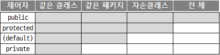
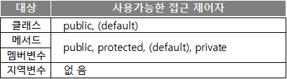

# **Chapter 03. 클래스(Class)**
## 클래스의 구성
```JAVA
// 이 클래스가 속한 패키지의 위치
package pack.age.name;  

// java.util 패키지에 있는 Calendar클래스를 import
import java.util.Calendar;  

// java.util 패키지에 있는 모든 클래스를 import
import java.util.*;

//클래스 선언 : 클래스명은 파일명(JavaClass.java)과 같아야 한다.
public class JavaClass{

    {
        //초기화 블록
    }

    int i = 0;          //인스턴스 변수
    static int j = 1;   //클래스 변수

    public JavaClass(){ //생성자
    }

    public int getMonth(){  //함수
        return Calendar.MONTH;
    }
}
```
[[예제 코드]](../../com/study/class02/Chapter03/Human.java)
<br><br>
## **제어자**
제어자는 크게 두가지로 나뉜다.
> **접근 제어자** : `public`, `protected`, `default`, `private`
>
> **그 외** : `static`, `final`, `abstract`, `native`, `transient`, `synchronized`, `volatile`, `strictfp`

- 제어자는 클래스나 멤버변수와 메서드에 주로 사용
- 하나의 대상에 대해서 여러 제어자를 조합하여 사용하는 것이 가능하다.
- **단, 접근 제어자는 한번에 하나만 사용 가능하다.**

### `static`
> static은 '클래스의' 또는 '공통적인'의 의미를 가지고 있다.
>
> 인스턴스변수는 하나의 클래스로 부터 생성되었더라도 각기 다른값을 유지하지만, 클래스변수(static멤버변수)는 인스턴스에 관계없이 같은 값을 갖는다.
> > **​`static`이 사용될 수 있는 곳 - 멤버변수, 메서드, 초기화 블럭**

<br>

### `final`
> 수학에서의 상수의 개념이다. π(PI)와 같은 절대 변하지 않는 숫자의 개념이다.
> > **`final`이 사용될 수 있는 곳 - 클래스, 메서드, 멤버변수, 지역변수**


### `abstract`
> abstract는 '미완성'의 의미를 가지고 있다.<br>
> 메서드의 선언부만 작성하고 실제 수행내용은 구현하지 않은 추상 메서드를 선언하는데 사용된다.
> > 상세 내용은 아래 [[추상클래스]](#**추상클레스**)에서 다룬다.

## **접근제어자**
> 멤버 또는 클래스에 사용되어, 해당하는 멤버 또는 클래스를 외부에서 접근하지 못하도록 제한하는 역할
> > - 접근 제어자가 `default`임을 알리기 위해 실제로 `default`를 붙이지 않는다.
> > - 아무런 접근제어자가 붙어있지 않다면 접근제어자가 `default`임을 뜻한다.
>
> ### `private`
> > 같은 클래스 내에서만 접근이 가능
> [[예제 코드]](../../com/study/class02/Chapter03/accesable/child_t/GrandChild.java)
>
> ### `default`
> > 같은 패키지 내에서만 접근이 가능
> [[예제 코드]](../../com/study/class02/Chapter03/accesable/child_s/GrandChild.java)
> 
> ### `public`
> > 접근 제한이 전혀 없다.
> [[예제 코드]](../../com/study/class02/Chapter03/accesable/child_f/GrandChild.java)
> 
> ### `protected`
> > 같은 패키지 내에서, 그리고 다른 패키지의 자손클래스에서 접근이 가능<br>
> [[예제_01]](../../com/study/class02/Chapter03/accesable/child_ff/GrandChild.java), 
> [[예제_02]](../../com/study/class02/Chapter03/accesable/Acc_top.java)
> 
> 
> 
> 접근 범위가 넓은 쪽에서 좁은 쪽의 순으로 왼쪽부터 나열
> > public > protected > (default) > private
> 
> 

## **상속**

## **추상클레스**

## **인터페이스**
